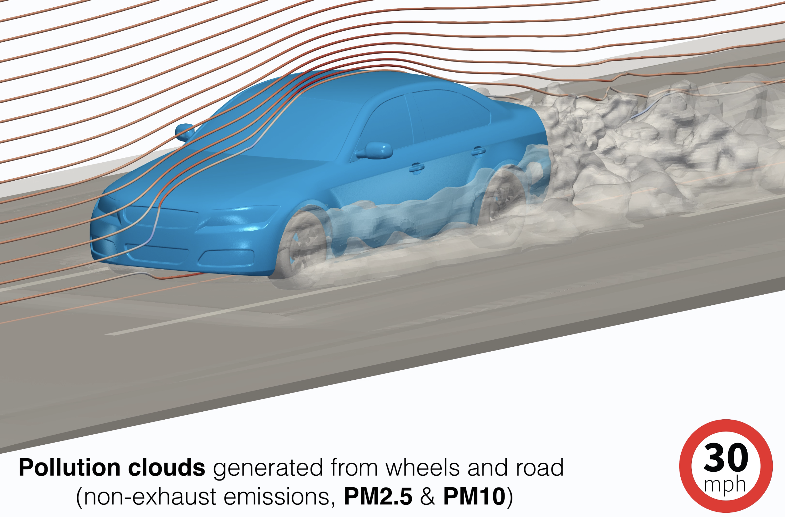

# drivaer-PM-emission

_This repository contains OpenFOAM (v2206) case files for performing computational fluid dynamics simulations on non-exhaust emissions from road vehicles._

## Background & Motivation

To address climate change and achieve net-zero targets set by governments around the world, the production of green house gas emissions from transport is a key area that needs to be resolved. This has led to a push to rapidly transition from internal combustion powered vehicles to electric vehicles. The removal of tail-pipe emissions will undoubtedly improve the health of the climate and improve air quality in part. However, electrification of road transport does not remove all particulate emissions from vehicles. Non-exhaust emissions from brakes, tyres and road dust resuspension will persist and these require attention given the impact of particulate matter on health (lung and cardiovascular disease, etc.) and the lack of regulation on these emission sources today.

Models that predict the tranpsort of air polluton typically span atmospheric scales down to city, building, and street scales. Vehicle models at street scale are also highly simplified (e.g. box shapes) and traditionally have not included non-exhaust sources. Therefore, a key area that is less well understood are the pathways for non-exhaust emissions from their source to the environment [doi:10.1016/j.envpol.2020.115654](https://doi.org/10.1016/j.envpol.2020.115654). 

The aim of this work was to investigate the spatio-temporal transport of non-exhaust emissions from road vehicles (e.g. tyres, road dust, brakes). In particular, we focused on fine and ultrafine particle matter which is most harmful to human health.

The vehicle geometry we have implemented is based on the [DrivAer model](https://www.epc.ed.tum.de/en/aer/research-groups/automotive/drivaer/) developed at the Technical University of Munich. This was chosen as it a realistic vehicle model for aerodynamics investigations and is openly accessible for research use. This has resulted in the publication of numerous experimental and numerical aerodynamic studies which also support computational validation. 

