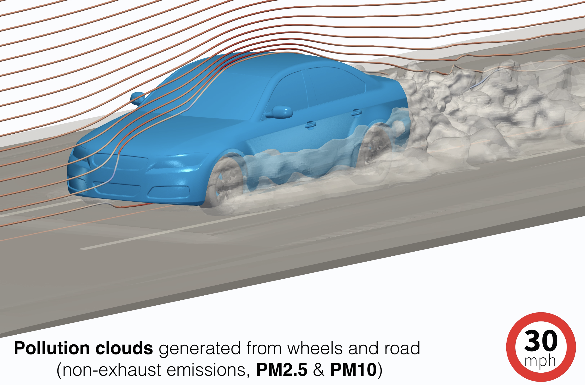
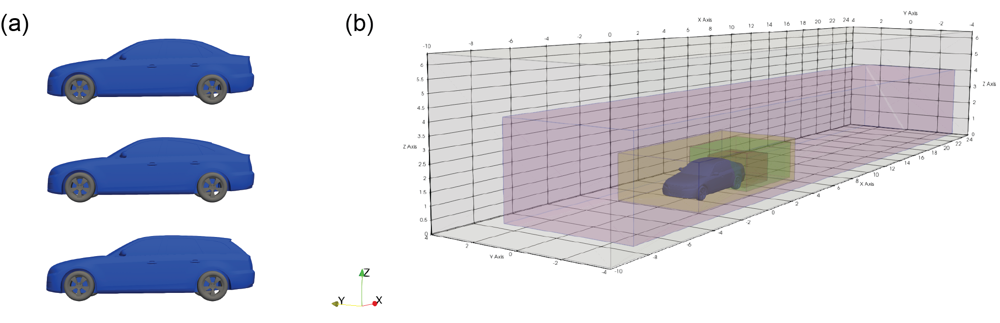

# vehicle-PM-emission

_This repository contains OpenFOAM (v2206) case files for performing computational fluid dynamics simulations on non-exhaust emissions from road vehicles._

Link to journal article and citation details here: **Manuscript under review**

## Background & Motivation

To address climate change and achieve net-zero targets set by governments around the world, the production of green house gas emissions from transport is a key area that needs to be resolved. This has led to a push to rapidly transition from internal combustion powered vehicles to electric vehicles. The removal of tail-pipe emissions will undoubtedly improve the health of the climate and improve air quality in part. However, electrification of road transport does not remove all particulate emissions from vehicles. Non-exhaust emissions from brakes, tyres and road dust resuspension will persist and these require attention given the impact of particulate matter on health (lung and cardiovascular disease, etc.) and the lack of regulation on these emission sources today.

Models that predict the transport of air pollution typically span atmospheric scales down to city, building, and street scales. Vehicle models at street scale are also highly simplified (e.g. box shapes) and traditionally have not included non-exhaust sources. Therefore, a key area that is less well understood are the [pathways for non-exhaust emissions from their source to the environment](https://doi.org/10.1016/j.envpol.2020.115654). 

The aim of this work was to investigate the spatio-temporal transport of non-exhaust emissions from road vehicles (e.g. tyres, road dust, brakes). In particular, we focused on fine and ultrafine particle matter which is most harmful to human health. The dispersion of the fine particles are represented as a continuum and solved using a scalar transport equation. The turbulent flow is modelled using a [Detached-Eddy Simulation approach](https://doi.org/10.1007/s00162-006-0015-0) and for a harsh braking event in an urban environment. In this case, the vehicle travels at 30mph for 15s, brakes from 30mph to 0mph for 2s, and idles at 0mph for a further 3s. This allows us to explore the transport of the pollutants in locations close to humans (e.g., traffic lights, pedestrian crossings, bus stops). 

## Vehicle and domain details

The vehicle geometry we have implemented is based on the [DrivAer model](https://www.epc.ed.tum.de/en/aer/research-groups/automotive/drivaer/) developed at the Technical University of Munich. This was chosen as it a realistic vehicle model for aerodynamics investigations and is openly accessible for research use. Numerous experimental and numerical aerodynamics studies have been published which also support computational validation. The figure below shows the notchback, fastback and estate vehicles (a), along with the computational domain and inner mesh refinement zones (b). Some of the mesh and refinement zones are adjusted based on the vehicle type under investigation.

We also acknowledge the steady-state WolfDynamics [tutorials](http://www.wolfdynamics.com/tutorials.html?id=94) which were a useful reference resource during the construction of the full-scale, time-dependent model in this repository.

## Model validation

The model was validated against previous aerodynamic investigations on the DrivAer model. Below shows the drag coefficient over time.

